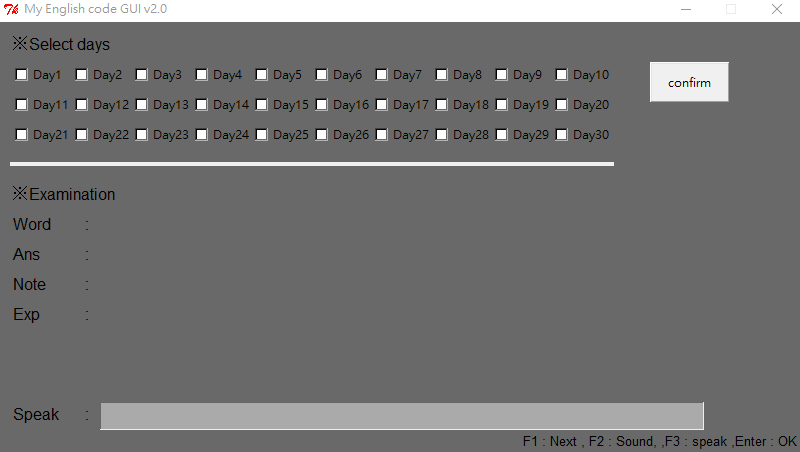
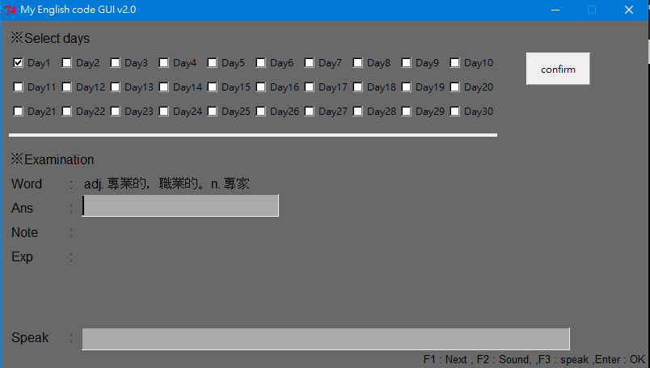
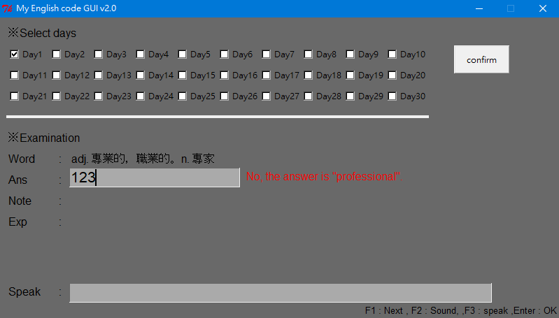
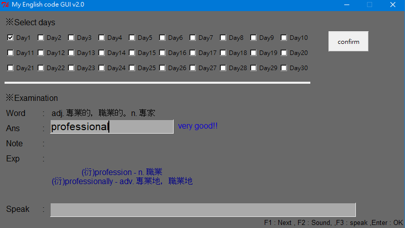

# 英文單字練習
___
## 用法
1. 執行 : python run.py
2. 在Select days 中選擇天數(可複選)
3. 確認後按下confirm
4. 開始練習
5. Word  : 顯示中文單字 
6. Ans   : 使用者作答
7. Note  : 作答前顯示文字區
8. Exp   : 作答後顯示文字區
9. Speak : 使用者鍵入想發聲的單字或字串
10. (按鍵)F1 : 下一題
11. (按鍵)F2 : Word 發聲
12. (按鍵)F3 : Speak 發聲，自行設定
13. (按鍵)Eenter : 作答結果

## 注意
1. 單字庫需使用者自行輸入
2. 以 word.json 存取，使用者自行增加即可。
3. 須注意 json 格式，不然編譯會失敗。

格式 : 
{
	"Day1":[
		["Word","Ans","Note","Exp"],
		.
		.
		.
		(略)
	],
	"Day2":[
		["Word","Ans","Note","Exp"],
	.
	.
	.
	(略)
}

## 執行畫面

